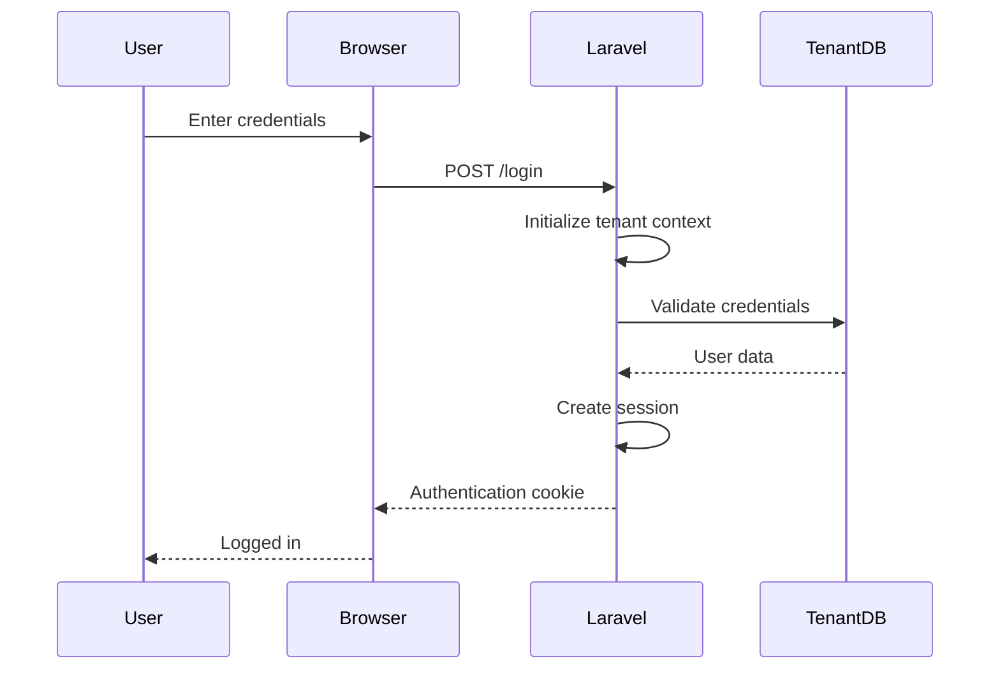

# Authentication & Authorization

SaaSBee implements a comprehensive authentication and authorization system with multi-tenant support, role-based access control, and secure session management.

## 🔐 Authentication Architecture

### Multi-Tenant Authentication
- **Tenant Context**: User authentication occurs within tenant-specific databases
- **Email Verification**: Required for all user accounts
- **Session Management**: Secure session handling with Laravel Sanctum
- **Password Security**: Bcrypt hashing with configurable policies

### Authentication Flow


## 👤 User Management

### User Model
```php
// app/Models/User.php
class User extends Authenticatable implements MustVerifyEmail
{
    use HasFactory, HasRoles, HasUuids, Notifiable;

    protected $fillable = ['name', 'email', 'password'];
    
    protected $hidden = ['password', 'remember_token'];
    
    protected $casts = [
        'email_verified_at' => 'datetime',
        'password' => 'hashed'
    ];
    
    // Role-based methods
    public function hasRole(string $role): bool
    public function hasPermission(string $permission): bool
    public function assignRole(string $role): void
}
```

### User Registration
User registration happens at the tenant level through the tenant owner setup process:

```php
// app/Jobs/CreateTenantOwner.php
public function handle()
{
    tenancy()->initialize($this->tenant);
    
    // Create owner user in tenant database
    $user = User::create([
        'name' => $this->tenant->owner_name,
        'email' => $this->tenant->owner_email,
        'password' => Hash::make(Str::random(32)),
    ]);
    
    // Assign admin role
    $user->assignRole('tenant_owner');
    
    // Send welcome email with setup instructions
    Mail::to($user)->send(new TenantOwnerWelcome($this->tenant));
}
```

## 🔑 Login Process

### Login Controller
```php
// app/Http/Controllers/Auth/AuthenticatedSessionController.php
class AuthenticatedSessionController extends Controller
{
    public function create(): Response
    {
        return Inertia::render('auth/login');
    }

    public function store(LoginRequest $request): RedirectResponse
    {
        $request->authenticate();
        $request->session()->regenerate();
        
        return redirect()->intended('/');
    }

    public function destroy(Request $request): RedirectResponse
    {
        Auth::guard('web')->logout();
        $request->session()->invalidate();
        $request->session()->regenerateToken();
        
        return redirect('/');
    }
}
```

### Login Request Validation
```php
// app/Http/Requests/Auth/LoginRequest.php
class LoginRequest extends FormRequest
{
    public function rules(): array
    {
        return [
            'email' => ['required', 'string', 'email'],
            'password' => ['required', 'string'],
        ];
    }

    public function authenticate(): void
    {
        $this->ensureIsNotRateLimited();

        if (!Auth::attempt($this->only('email', 'password'), $this->boolean('remember'))) {
            RateLimiter::hit($this->throttleKey());
            throw ValidationException::withMessages([
                'email' => trans('auth.failed'),
            ]);
        }

        RateLimiter::clear($this->throttleKey());
    }
}
```

## 📧 Email Verification

### Email Verification Flow
1. User registers or is created by tenant owner
2. Verification email sent automatically
3. User clicks verification link
4. Email marked as verified in database
5. User gains full access to tenant features

### Verification Routes
```php
// routes/auth.php
Route::middleware('auth')->group(function () {
    Route::get('verify-email', EmailVerificationPromptController::class)
        ->name('verification.notice');

    Route::get('verify-email/{id}/{hash}', VerifyEmailController::class)
        ->middleware(['signed', 'throttle:6,1'])
        ->name('verification.verify');

    Route::post('email/verification-notification', 
        [EmailVerificationNotificationController::class, 'store'])
        ->middleware('throttle:6,1')
        ->name('verification.send');
});
```

### Verification Middleware
```php
// Protect routes requiring verified email
Route::middleware(['auth', 'verified'])->group(function () {
    Route::get('/', function () {
        return Inertia::render('dashboard');
    })->name('dashboard');
});
```

## 🛡️ Role-Based Access Control (RBAC)

### Permission System
SaaSBee uses Spatie Laravel Permission for role and permission management.

#### Default Roles
- **tenant_owner**: Full administrative access within tenant
- **admin**: Administrative privileges
- **manager**: Management-level access
- **user**: Basic user access

#### Default Permissions
```php
// database/seeders/RoleSeeder.php
$permissions = [
    // User management
    'view_users',
    'create_users', 
    'edit_users',
    'delete_users',
    
    // Role management
    'view_roles',
    'create_roles',
    'edit_roles', 
    'delete_roles',
    'assign_roles',
    
    // Settings
    'view_settings',
    'edit_settings',
    'view_billing',
    'manage_billing',
    
    // Reports
    'view_reports',
    'export_reports',
];
```

### Role Management Actions

#### Create Role
```php
// app/Actions/Settings/CreateRole.php
class CreateRole
{
    use AsAction;

    public function rules(): array
    {
        return [
            'name' => 'required|string|max:255|unique:roles',
            'permissions' => 'array',
            'permissions.*' => 'exists:permissions,name',
        ];
    }

    public function handle(array $data): Role
    {
        $role = Role::create(['name' => $data['name']]);
        
        if (isset($data['permissions'])) {
            $role->syncPermissions($data['permissions']);
        }
        
        return $role;
    }
}
```

#### Assign Role to User
```php
// app/Actions/Settings/AssignUserRole.php
class AssignUserRole
{
    use AsAction;

    public function rules(): array
    {
        return [
            'user_id' => 'required|exists:users,id',
            'role_name' => 'required|exists:roles,name',
        ];
    }

    public function handle(array $data): void
    {
        $user = User::findOrFail($data['user_id']);
        $user->assignRole($data['role_name']);
    }
}
```

### Permission Checking

#### In Controllers
```php
class SomeController extends Controller
{
    public function index()
    {
        $this->authorize('view_users');
        // Controller logic
    }
    
    public function store(Request $request)
    {
        if (!$request->user()->can('create_users')) {
            abort(403, 'Unauthorized');
        }
        // Controller logic
    }
}
```

#### In Blade/React Components
```php
// In React via Inertia props
@can('edit_users')
    <EditButton />
@endcan

// Via props passed to React
$props = [
    'can' => [
        'edit_users' => auth()->user()->can('edit_users'),
        'delete_users' => auth()->user()->can('delete_users'),
    ]
];
```

#### In Middleware
```php
// Protect routes with role middleware
Route::middleware(['auth', 'role:tenant_owner'])->group(function () {
    Route::get('/settings/roles', ManageRoles::class);
});

// Protect with permission middleware
Route::middleware(['auth', 'permission:manage_billing'])->group(function () {
    Route::post('/settings/billing/subscribe', CreateSubscription::class);
});
```

## 🔐 Password Management

### Password Reset Flow
```php
// app/Http/Controllers/Auth/PasswordResetLinkController.php
class PasswordResetLinkController extends Controller
{
    public function store(Request $request): RedirectResponse
    {
        $request->validate(['email' => 'required|email']);

        $status = Password::sendResetLink(
            $request->only('email')
        );

        return $status === Password::RESET_LINK_SENT
            ? back()->with(['status' => __($status)])
            : back()->withErrors(['email' => __($status)]);
    }
}
```

### Password Policy
```php
// config/auth.php
'password_timeout' => 10800, // 3 hours

// Custom password rules
Password::defaults(function () {
    $rule = Password::min(8);
    
    return $this->app->isProduction()
        ? $rule->mixedCase()->numbers()->symbols()->uncompromised()
        : $rule;
});
```

## 🔒 Security Features

### Rate Limiting
```php
// Applied to sensitive routes
Route::middleware('throttle:6,1')->group(function () {
    Route::post('/login', [AuthenticatedSessionController::class, 'store']);
    Route::post('/forgot-password', [PasswordResetLinkController::class, 'store']);
    Route::post('/email/verification-notification', ...);
});
```

### CSRF Protection
All forms automatically protected by Laravel's CSRF middleware:
```php
// Middleware applied to 'web' routes
\Illuminate\Foundation\Http\Middleware\ValidateCsrfToken::class
```

### Session Security
```php
// config/session.php
'secure' => env('SESSION_SECURE_COOKIE', true),
'http_only' => true,
'same_site' => 'lax',
'encrypt' => true,
```

### Password Confirmation
Sensitive operations require password confirmation:
```php
Route::middleware(['auth', 'password.confirm'])->group(function () {
    Route::delete('/settings/profile', [ProfileController::class, 'destroy']);
});
```

## 🧪 Testing Authentication

### Authentication Tests
```php
// tests/Feature/Auth/AuthenticationTest.php
class AuthenticationTest extends TestCase
{
    use RefreshDatabase;

    public function test_login_screen_can_be_rendered(): void
    {
        $response = $this->get('/login');
        $response->assertStatus(200);
    }

    public function test_users_can_authenticate_using_the_login_screen(): void
    {
        $user = User::factory()->create();

        $response = $this->post('/login', [
            'email' => $user->email,
            'password' => 'password',
        ]);

        $this->assertAuthenticated();
        $response->assertRedirect('/');
    }
}
```

### Permission Tests
```php
// tests/Feature/PermissionTest.php
class PermissionTest extends TestCase
{
    use RefreshDatabase;

    public function test_tenant_owner_can_manage_roles(): void
    {
        $tenant = $this->createTenant();
        $this->initializeTenancy($tenant);
        
        $user = User::factory()->create();
        $user->assignRole('tenant_owner');

        $response = $this->actingAs($user)->get('/settings/roles');
        $response->assertStatus(200);
    }

    public function test_regular_user_cannot_manage_roles(): void
    {
        $tenant = $this->createTenant();
        $this->initializeTenancy($tenant);
        
        $user = User::factory()->create();
        $user->assignRole('user');

        $response = $this->actingAs($user)->get('/settings/roles');
        $response->assertStatus(403);
    }
}
```

## 🔧 Configuration

### Authentication Configuration
```php
// config/auth.php
'defaults' => [
    'guard' => 'web',
    'passwords' => 'users',
],

'guards' => [
    'web' => [
        'driver' => 'session',
        'provider' => 'users',
    ],
],

'providers' => [
    'users' => [
        'driver' => 'eloquent',
        'model' => \App\Models\User::class,
    ],
],
```

### Permission Configuration
```php
// config/permission.php
'models' => [
    'permission' => \App\Models\Permission::class,
    'role' => \App\Models\Role::class,
],

'table_names' => [
    'roles' => 'roles',
    'permissions' => 'permissions',
    'model_has_permissions' => 'model_has_permissions',
    'model_has_roles' => 'model_has_roles',
    'role_has_permissions' => 'role_has_permissions',
],

'cache' => [
    'expiration_time' => \DateInterval::createFromDateString('24 hours'),
    'key' => 'spatie.permission.cache',
    'store' => 'default',
],
```

## 🚀 Advanced Features

### Two-Factor Authentication (Future Enhancement)
```php
// Potential 2FA implementation
trait HasTwoFactorAuthentication
{
    public function enableTwoFactorAuthentication()
    {
        $this->two_factor_secret = encrypt(app(TwoFactorAuthenticationProvider::class)->generateSecretKey());
        $this->save();
    }
    
    public function disableTwoFactorAuthentication()
    {
        $this->two_factor_secret = null;
        $this->two_factor_recovery_codes = null;
        $this->save();
    }
}
```

### API Authentication (Future Enhancement)
```php
// API token authentication
Route::middleware('auth:sanctum')->group(function () {
    Route::get('/api/user', function (Request $request) {
        return $request->user();
    });
});
```

This authentication and authorization system provides robust security for multi-tenant SaaS applications with flexible role management and comprehensive access control.