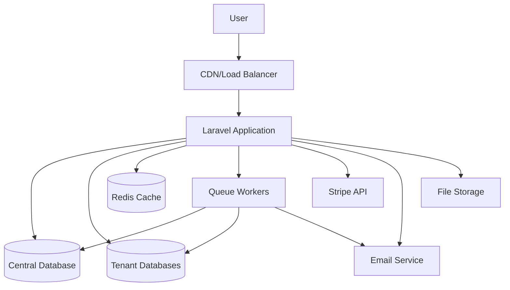
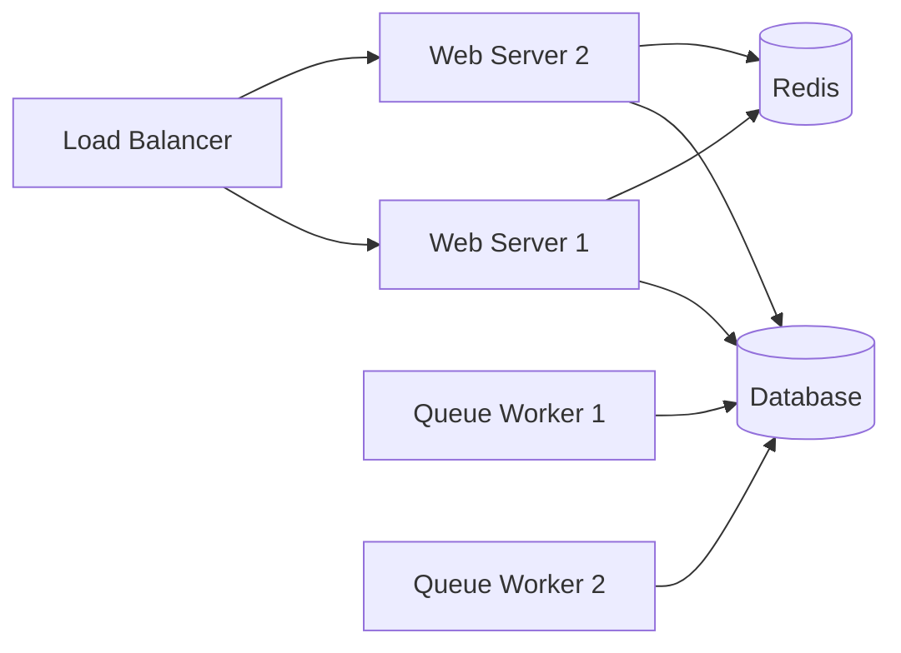

# Project Architecture Overview

SaaSBee is built as a modern multi-tenant SaaS application using Laravel and React. This document provides a high-level overview of the system architecture and design principles.

## 🏗️ Architecture Principles

### Multi-Tenant by Design
- **Tenant Isolation**: Each tenant has its own database and isolated data
- **Subdomain Routing**: Tenants access their data via unique subdomains
- **Shared Infrastructure**: Common services shared across all tenants

### Modern Full-Stack Architecture
- **Backend**: Laravel 12 API with business logic organized in Actions
- **Frontend**: React 19 SPA with TypeScript and Tailwind CSS
- **Communication**: Inertia.js bridges backend and frontend seamlessly

### Event-Driven Architecture
- **Queue System**: Background job processing for async operations
- **Event Handling**: Laravel events for decoupled business logic
- **Real-time Updates**: WebSocket support for live notifications

## 🌐 System Overview



## 📦 Application Structure

### Backend (Laravel)
```
app/
├── Actions/              # Business logic (Laravel Actions)
│   ├── Central/         # Central application actions
│   └── Settings/        # Tenant-specific actions
├── Models/              # Eloquent models
│   ├── Tenant.php       # Multi-tenant model
│   ├── User.php         # User model (tenant-aware)
│   └── ...
├── Http/
│   ├── Controllers/     # Route controllers
│   ├── Middleware/      # Request middleware
│   └── Requests/        # Form validation
├── Jobs/                # Background jobs
├── Mail/                # Email templates
└── Observers/           # Model observers
```

### Frontend (React)
```
resources/js/
├── components/          # Reusable UI components
│   ├── ui/             # Base UI components (Radix UI)
│   ├── settings/       # Settings-specific components
│   └── stripe/         # Payment components
├── pages/              # Page components (Inertia routes)
│   ├── auth/           # Authentication pages
│   ├── central/        # Central app pages
│   └── settings/       # Tenant settings pages
├── layouts/            # Layout components
├── hooks/              # Custom React hooks
├── lib/                # Utility functions
└── types/              # TypeScript definitions
```

## 🔄 Request Flow

### Tenant Requests
1. **Domain Resolution**: User accesses `tenant.yourdomain.com`
2. **Tenancy Middleware**: System identifies tenant from subdomain
3. **Database Switch**: Laravel switches to tenant's database
4. **Authentication**: User authentication within tenant context
5. **Action Processing**: Business logic executed via Laravel Actions
6. **Response**: Inertia.js renders React components with data

### Central Requests
1. **Central Domain**: User accesses main domain
2. **Central Context**: System operates in central (non-tenant) mode
3. **Registration/Management**: Tenant creation and management
4. **Stripe Integration**: Payment processing and subscription management

## 🗄️ Data Architecture

### Central Database
- **Tenants**: Tenant information and metadata
- **Domains**: Domain-to-tenant mapping
- **Subscriptions**: Stripe subscription data
- **System Users**: Central application users

### Tenant Databases
Each tenant has an isolated database containing:
- **Users**: Tenant's users and permissions
- **Roles & Permissions**: Role-based access control
- **Business Data**: Application-specific data
- **Settings**: Tenant configuration

## 🔐 Security Architecture

### Multi-Tenant Security
- **Database Isolation**: Complete data separation per tenant
- **Context Validation**: Middleware ensures proper tenant context
- **Domain Verification**: Requests validated against tenant domains

### Authentication & Authorization
- **Laravel Sanctum**: API token authentication
- **Spatie Permissions**: Role-based access control (RBAC)
- **Password Security**: Bcrypt hashing with secure policies

### Data Protection
- **CSRF Protection**: Laravel's built-in CSRF protection
- **SQL Injection**: Eloquent ORM prevents SQL injection
- **XSS Protection**: React's built-in XSS protection

## 📡 Integration Architecture

### Payment Processing
- **Stripe Integration**: Laravel Cashier for subscription management
- **Webhook Handling**: Secure webhook processing for payment events
- **Trial Management**: Automated trial period handling

### Email System
- **Multi-Provider**: Support for SMTP, SES, Mailgun, Postmark
- **Queue Processing**: Async email sending via background jobs
- **Template System**: Blade templates with React components

### File Storage
- **Laravel Filesystem**: Abstracted file storage
- **Multi-Provider**: Local, S3, MinIO support
- **Tenant Isolation**: File separation per tenant

## 🚀 Deployment Architecture

### Production Setup


### Scaling Considerations
- **Horizontal Scaling**: Multiple web servers behind load balancer
- **Database Scaling**: Read replicas and connection pooling
- **Queue Scaling**: Multiple queue workers for background processing
- **Cache Scaling**: Redis cluster for high availability

## 🔧 Development Workflow

### Local Development
1. **Docker Services**: PostgreSQL, Redis, MinIO via Docker Compose
2. **Hot Reloading**: Vite for frontend, Laravel for backend
3. **Queue Processing**: Local queue workers for testing
4. **Email Testing**: Mailpit for email preview

### Testing Strategy
- **Feature Tests**: End-to-end functionality testing
- **Unit Tests**: Individual component testing
- **Browser Tests**: Automated UI testing with Laravel Dusk
- **API Tests**: Endpoint testing with Pest PHP

## 📊 Monitoring & Observability

### Application Monitoring
- **Laravel Telescope**: Development debugging and profiling
- **Laravel Pail**: Real-time log monitoring
- **Queue Monitoring**: Job processing and failure tracking

### Performance Monitoring
- **Database Query Optimization**: Eloquent query analysis
- **Cache Hit Rates**: Redis performance monitoring
- **Response Time Tracking**: Application performance metrics

---

This architecture provides a solid foundation for scalable, secure multi-tenant SaaS applications. The modular design allows for easy customization and extension based on specific business requirements.