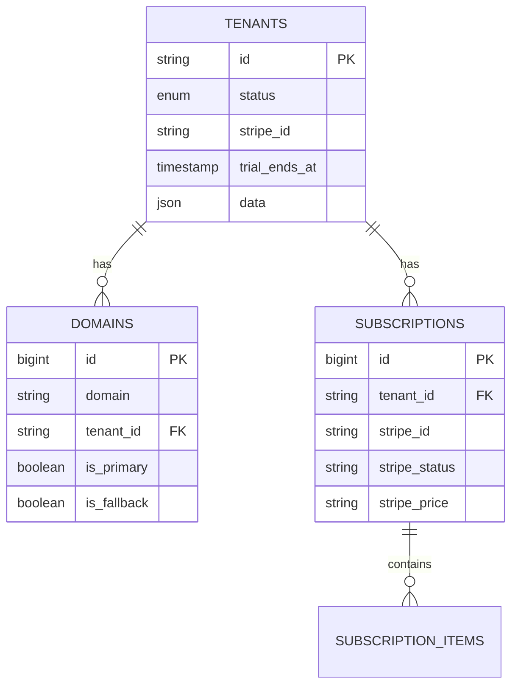
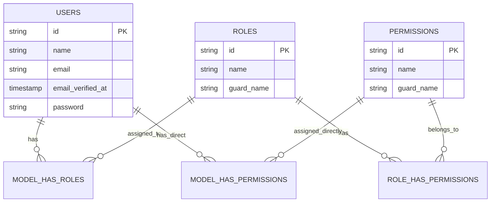

# Database Schema Overview

SaaSBee uses a multi-tenant database architecture with separate databases for central management and individual tenants. This document outlines the complete database schema and relationships.

## 🏗️ Database Architecture

### Central Database
Contains global data for tenant management, subscriptions, and system administration.

### Tenant Databases
Each tenant has an isolated database containing user data, permissions, and tenant-specific information.

## 🗄️ Central Database Schema

### Tenants Table
Stores tenant information and metadata.

```sql
CREATE TABLE tenants (
    id VARCHAR(36) PRIMARY KEY,           -- UUID primary key
    status ENUM(                          -- Tenant status
        'pending_approval',
        'active', 
        'suspended',
        'cancelled'
    ) DEFAULT 'pending_approval',
    stripe_id VARCHAR(255) NULL,          -- Stripe customer ID
    card_brand VARCHAR(255) NULL,         -- Payment card brand
    card_last_four VARCHAR(4) NULL,       -- Last 4 digits of card
    trial_ends_at TIMESTAMP NULL,         -- Trial expiration
    created_at TIMESTAMP NOT NULL,
    updated_at TIMESTAMP NOT NULL,
    data JSON NULL                        -- Additional tenant metadata
);

CREATE INDEX tenants_stripe_id_index ON tenants (stripe_id);
```

**Key Relationships:**
- One-to-many with `domains`
- One-to-many with `subscriptions`

### Domains Table
Maps domains/subdomains to tenants for routing.

```sql
CREATE TABLE domains (
    id BIGINT PRIMARY KEY AUTO_INCREMENT,
    domain VARCHAR(255) NOT NULL UNIQUE,  -- Domain/subdomain
    tenant_id VARCHAR(36) NOT NULL,       -- Foreign key to tenants
    is_primary BOOLEAN DEFAULT FALSE,     -- Primary domain flag
    is_fallback BOOLEAN DEFAULT FALSE,    -- Fallback domain flag
    created_at TIMESTAMP NOT NULL,
    updated_at TIMESTAMP NOT NULL,
    FOREIGN KEY (tenant_id) REFERENCES tenants(id) ON DELETE CASCADE
);

CREATE INDEX domains_tenant_id_index ON domains (tenant_id);
```

### Subscriptions Table
Stores Stripe subscription information for tenants.

```sql
CREATE TABLE subscriptions (
    id BIGINT PRIMARY KEY AUTO_INCREMENT,
    tenant_id VARCHAR(36) NOT NULL,       -- Foreign key to tenants
    type VARCHAR(255) NOT NULL,           -- Subscription type
    stripe_id VARCHAR(255) NOT NULL,      -- Stripe subscription ID
    stripe_status VARCHAR(255) NOT NULL,  -- Stripe subscription status
    stripe_price VARCHAR(255) NULL,       -- Stripe price ID
    quantity INTEGER NULL,                -- Subscription quantity
    trial_ends_at TIMESTAMP NULL,         -- Trial period end
    ends_at TIMESTAMP NULL,               -- Subscription end date
    created_at TIMESTAMP NOT NULL,
    updated_at TIMESTAMP NOT NULL
);

CREATE INDEX subscriptions_tenant_id_stripe_status_index 
ON subscriptions (tenant_id, stripe_status);
```

### Subscription Items Table
Detailed line items for subscriptions.

```sql
CREATE TABLE subscription_items (
    id BIGINT PRIMARY KEY AUTO_INCREMENT,
    subscription_id BIGINT NOT NULL,      -- Foreign key to subscriptions
    stripe_id VARCHAR(255) NOT NULL,      -- Stripe subscription item ID
    stripe_product VARCHAR(255) NOT NULL, -- Stripe product ID
    stripe_price VARCHAR(255) NOT NULL,   -- Stripe price ID
    quantity INTEGER NULL,                -- Item quantity
    created_at TIMESTAMP NOT NULL,
    updated_at TIMESTAMP NOT NULL,
    FOREIGN KEY (subscription_id) REFERENCES subscriptions(id) ON DELETE CASCADE
);

CREATE INDEX subscription_items_subscription_id_index 
ON subscription_items (subscription_id);
```

### Customer Columns (Laravel Cashier)
Additional billing-related columns added to tenants table:

```sql
-- Added via migration to tenants table
ALTER TABLE tenants ADD COLUMN pm_type VARCHAR(255) NULL;
ALTER TABLE tenants ADD COLUMN pm_last_four VARCHAR(4) NULL;
```

## 👥 Tenant Database Schema

Each tenant database contains isolated user data and permissions.

### Users Table (Per Tenant)
User accounts within each tenant.

```sql
CREATE TABLE users (
    id VARCHAR(36) PRIMARY KEY,           -- UUID primary key
    name VARCHAR(255) NOT NULL,           -- User's full name
    email VARCHAR(255) NOT NULL UNIQUE,   -- Email address
    email_verified_at TIMESTAMP NULL,     -- Email verification timestamp
    password VARCHAR(255) NOT NULL,       -- Hashed password
    remember_token VARCHAR(100) NULL,     -- Remember me token
    created_at TIMESTAMP NOT NULL,
    updated_at TIMESTAMP NOT NULL
);

CREATE INDEX users_email_index ON users (email);
```

### Roles Table (Per Tenant)
User roles for permission management using Spatie Laravel Permission.

```sql
CREATE TABLE roles (
    id VARCHAR(36) PRIMARY KEY,           -- UUID primary key
    name VARCHAR(255) NOT NULL,           -- Role name
    guard_name VARCHAR(255) NOT NULL,     -- Guard name (web)
    created_at TIMESTAMP NOT NULL,
    updated_at TIMESTAMP NOT NULL,
    UNIQUE KEY roles_name_guard_name_unique (name, guard_name)
);
```

### Permissions Table (Per Tenant)
Individual permissions for fine-grained access control.

```sql
CREATE TABLE permissions (
    id VARCHAR(36) PRIMARY KEY,           -- UUID primary key
    name VARCHAR(255) NOT NULL,           -- Permission name
    guard_name VARCHAR(255) NOT NULL,     -- Guard name (web)
    created_at TIMESTAMP NOT NULL,
    updated_at TIMESTAMP NOT NULL,
    UNIQUE KEY permissions_name_guard_name_unique (name, guard_name)
);
```

### Role-Permission Relationships (Per Tenant)
Many-to-many relationship between roles and permissions.

```sql
CREATE TABLE role_has_permissions (
    permission_id VARCHAR(36) NOT NULL,   -- Foreign key to permissions
    role_id VARCHAR(36) NOT NULL,         -- Foreign key to roles
    PRIMARY KEY (permission_id, role_id),
    FOREIGN KEY (permission_id) REFERENCES permissions(id) ON DELETE CASCADE,
    FOREIGN KEY (role_id) REFERENCES roles(id) ON DELETE CASCADE
);
```

### User-Role Relationships (Per Tenant)
Many-to-many relationship between users and roles.

```sql
CREATE TABLE model_has_roles (
    role_id VARCHAR(36) NOT NULL,         -- Foreign key to roles
    model_type VARCHAR(255) NOT NULL,     -- Model class name
    model_id VARCHAR(36) NOT NULL,        -- Model UUID (user ID)
    PRIMARY KEY (role_id, model_id, model_type),
    FOREIGN KEY (role_id) REFERENCES roles(id) ON DELETE CASCADE
);

CREATE INDEX model_has_roles_model_id_model_type_index 
ON model_has_roles (model_id, model_type);
```

### User-Permission Relationships (Per Tenant)
Direct user permissions (bypassing roles).

```sql
CREATE TABLE model_has_permissions (
    permission_id VARCHAR(36) NOT NULL,   -- Foreign key to permissions
    model_type VARCHAR(255) NOT NULL,     -- Model class name
    model_id VARCHAR(36) NOT NULL,        -- Model UUID (user ID)
    PRIMARY KEY (permission_id, model_id, model_type),
    FOREIGN KEY (permission_id) REFERENCES permissions(id) ON DELETE CASCADE
);

CREATE INDEX model_has_permissions_model_id_model_type_index 
ON model_has_permissions (model_id, model_type);
```

## 🔗 Relationships Overview

### Central Database Relationships


### Tenant Database Relationships


## 📊 Model Definitions

### Central Models

#### Tenant Model
```php
// app/Models/Tenant.php
class Tenant extends BaseTenant implements TenantWithDatabase
{
    use Billable, HasDatabase, HasDomains;

    protected $fillable = [
        'name', 'status', 'owner_email', 'owner_name', 
        'domain', 'trial_ends_at'
    ];

    protected $casts = [
        'trial_ends_at' => 'datetime',
        'data' => 'array'
    ];

    // Relationships
    public function domains(): HasMany
    public function subscriptions(): HasMany
    
    // Business Logic
    public function isOnTrial(): bool
    public function hasValidSubscription(): bool
}
```

### Tenant Models

#### User Model
```php
// app/Models/User.php
class User extends Authenticatable implements MustVerifyEmail
{
    use HasFactory, HasRoles, HasUuids, Notifiable;

    protected $fillable = ['name', 'email', 'password'];
    
    protected $hidden = ['password', 'remember_token'];
    
    protected $casts = [
        'email_verified_at' => 'datetime',
        'password' => 'hashed'
    ];
}
```

#### Role Model
```php
// app/Models/Role.php
class Role extends SpatieRole
{
    use HasUuids;
}
```

#### Permission Model
```php
// app/Models/Permission.php
class Permission extends SpatiePermission
{
    use HasUuids;
}
```

## 🔧 Database Configuration

### Multi-Database Setup
```php
// config/database.php
'connections' => [
    'central' => [
        'driver' => 'pgsql',
        'host' => env('DB_HOST', '127.0.0.1'),
        'database' => env('DB_DATABASE', 'saasbee_central'),
        // ...
    ],
    
    'tenant' => [
        'driver' => 'pgsql',
        'host' => env('DB_HOST', '127.0.0.1'),
        'database' => null, // Set dynamically per tenant
        // ...
    ]
],
```

### Tenant Database Naming
```php
// config/tenancy.php
'database' => [
    'prefix' => 'tenant_',
    'suffix' => '',
    'template_tenant_connection' => null,
],
```

Example tenant database names:
- `tenant_71e64123-b603-4150-907a-c60b25ee9b91`
- `tenant_b32d1f1d-cc18-41dd-aa31-bb05a7070b60`

## 🚀 Migration Management

### Central Migrations
```bash
# Run central database migrations
php artisan migrate

# Create central migration
php artisan make:migration create_example_table
```

### Tenant Migrations
```bash
# Run tenant migrations for all tenants
php artisan tenants:migrate

# Create tenant-specific migration
php artisan make:migration create_tenant_table --path=database/migrations/tenant

# Run migration for specific tenant
php artisan tenants:run --tenant=uuid migrate
```

## 📈 Indexing Strategy

### Performance Indexes
- **Tenant lookup**: `domains.domain` (unique)
- **Subscription status**: `subscriptions.tenant_id, stripe_status`
- **User authentication**: `users.email` (unique per tenant)
- **Role assignments**: `model_has_roles.model_id, model_type`

### Query Optimization
- Use eager loading for relationships
- Index foreign key columns
- Consider partitioning for large datasets

This schema provides a robust foundation for multi-tenant SaaS applications with proper data isolation, security, and scalability considerations.